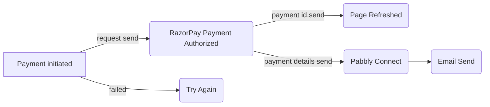

# Payment Integration Gateway

# Payments Integration Gateway

Created a website where donor can donate as much money they want

>Technologies used
- **HTML**
- **CSS**
- **Vanilla JavaScript**
- **RazorPay**
- **Pabbly Connect**

## Switch to another file
>  There will be a simple donate button on homepage. On clicking
the donate button, the user will land on the payment page where
user can select the amount to be paid and the payment type, e.g.
credit card, Paypal, etc. 

>  Once the payment is done and invoice will be generated and
email will be sent to the user for the payment received. The
invoice will contain the amount.


## Usage
`git clone https://github.com/tanujdey7/payment-gateway-integration`
- Change the API key with your key and you are ready to accept payments

## Flow Chart

The MIT License (MIT)
===================
Copyright © `2021` `Tanuj Dey`

Permission is hereby granted, free of charge, to any person
obtaining a copy of this software and associated documentation
files (the “Software”), to deal in the Software without
restriction, including without limitation the rights to use,
copy, modify, merge, publish, distribute, sublicense, and/or sell
copies of the Software, and to permit persons to whom the
Software is furnished to do so, subject to the following
conditions:

The above copyright notice and this permission notice shall be
included in all copies or substantial portions of the Software.

THE SOFTWARE IS PROVIDED “AS IS”, WITHOUT WARRANTY OF ANY KIND,
EXPRESS OR IMPLIED, INCLUDING BUT NOT LIMITED TO THE WARRANTIES
OF MERCHANTABILITY, FITNESS FOR A PARTICULAR PURPOSE AND
NONINFRINGEMENT. IN NO EVENT SHALL THE AUTHORS OR COPYRIGHT
HOLDERS BE LIABLE FOR ANY CLAIM, DAMAGES OR OTHER LIABILITY,
WHETHER IN AN ACTION OF CONTRACT, TORT OR OTHERWISE, ARISING
FROM, OUT OF OR IN CONNECTION WITH THE SOFTWARE OR THE USE OR
OTHER DEALINGS IN THE SOFTWARE.
```